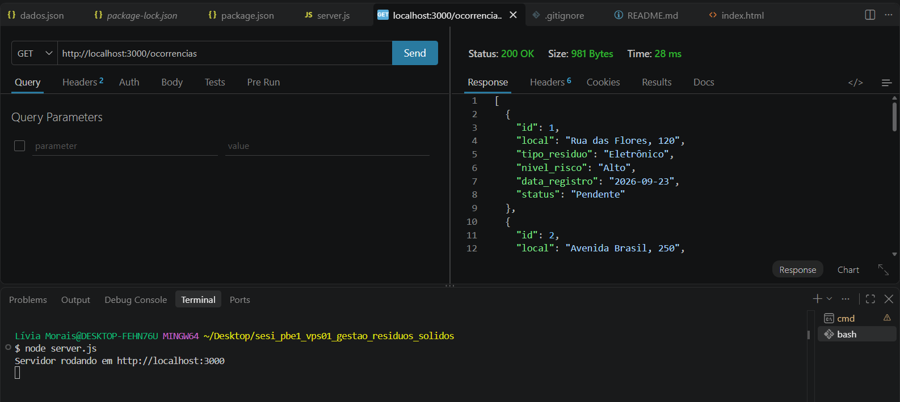
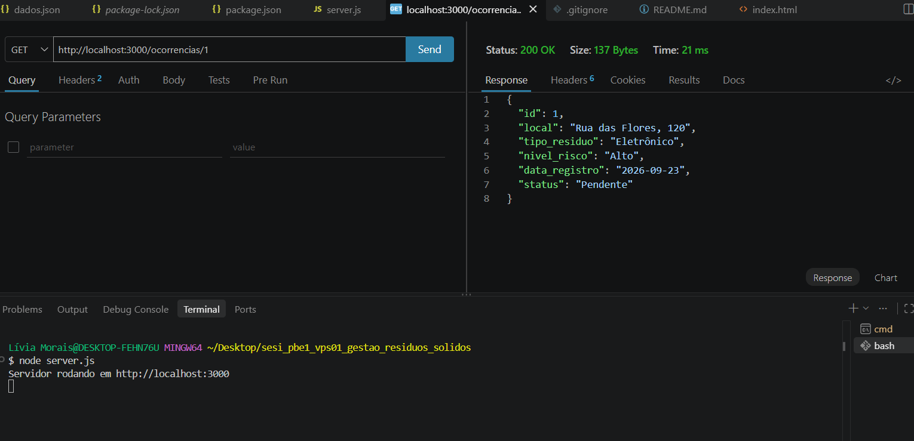
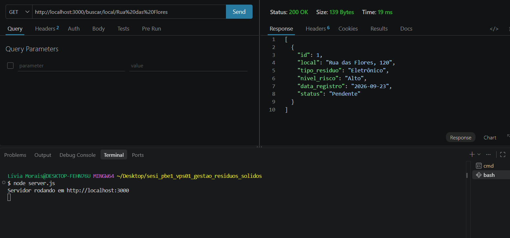
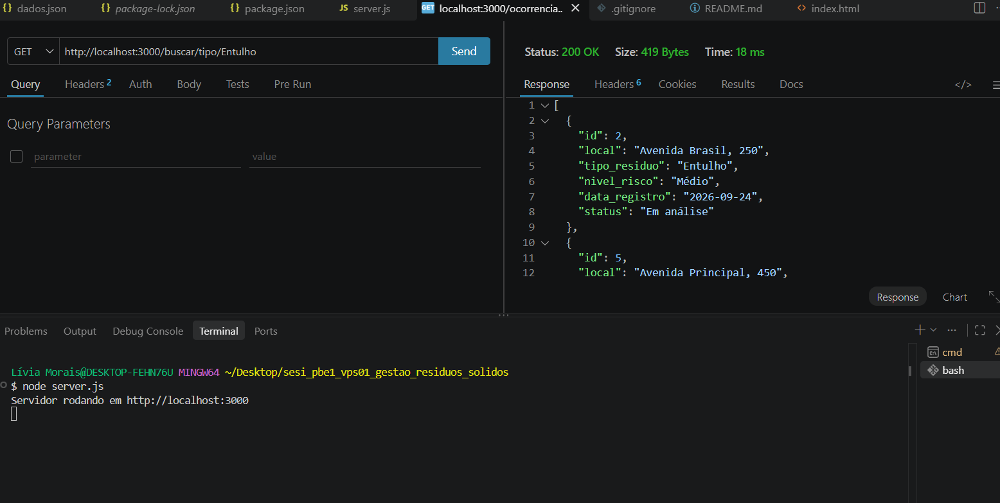
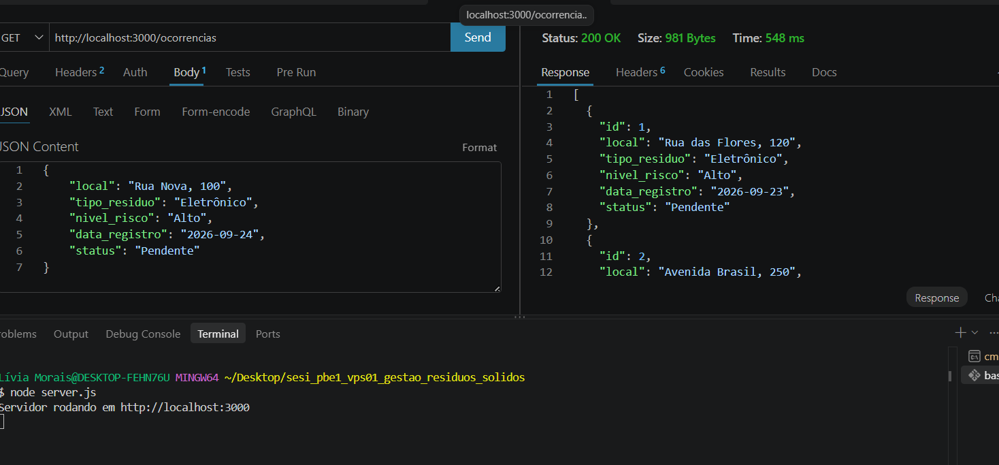
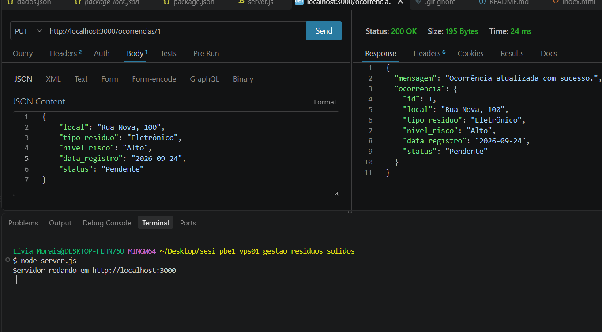
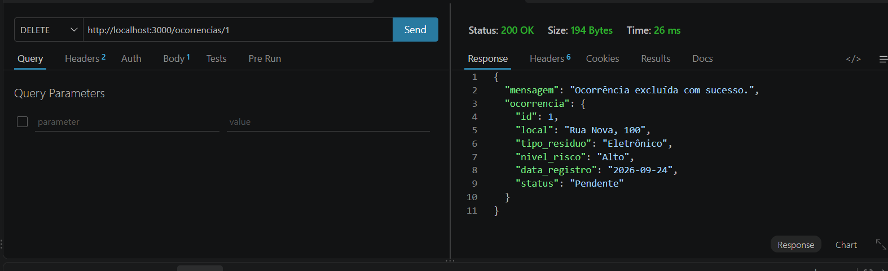

# Gestão de Resíduos Sólidos

## Descrição

Projeto desenvolvido para a atividade de Back-End do SENAI.

O sistema foi criado para registrar pontos de descarte irregular de resíduos, como lixo doméstico, entulho, resíduos eletrônicos e recicláveis.

É possível cadastrar, consultar, atualizar e excluir ocorrências.

## Tecnologias

* Node.js
* Express
* JavaScript
* JSON
* HTML
* CSS
* Thunder Client
* GitHub

## Estrutura do projeto

```text
sesi_pbe1_vps01_gestao_residuos_2026
│
├── dados.json
├── server.js
├── package.json
├── .gitignore
│
├── client
│   └── index.html
│
└── prints
    ├── listar.png
    ├── listar_por_id.png
    ├── teste_por_local.png
    ├── teste_por_tipo.png
    ├── cadastrar.png
    ├── atualizar_cadastro.png
    ├── put_atualizar.png
    └── delete.png
```

## Dados

O arquivo `dados.json` possui os registros das ocorrências.

Cada registro possui:

* ID
* Local
* Tipo de resíduo
* Nível de risco
* Data do registro
* Status

O ID é criado automaticamente quando uma nova ocorrência é cadastrada.

## Rotas

### Listar ocorrências

**GET**

```text
http://localhost:3000/ocorrencias
```



### Listar por ID

**GET**

```text
http://localhost:3000/ocorrencias/1
```



### Buscar por local

**GET**

```text
http://localhost:3000/buscar/local/Rua%20das%20Flores
```



### Buscar por tipo

**GET**

```text
http://localhost:3000/buscar/tipo/Entulho
```



### Cadastrar ocorrência

**GET**

```text
http://localhost:3000/ocorrencias
```

Exemplo:

```json
{
    "local": "Rua Nova, 100",
    "tipo_residuo": "Eletrônico",
    "nivel_risco": "Alto",
    "data_registro": "2026-09-24",
    "status": "Pendente"
}
```



### Atualizar ocorrência

**PUT**

```text
http://localhost:3000/ocorrencias/1
```

Exemplo:

```json
{
    "local": "Rua Nova, 100",
    "tipo_residuo": "Eletrônico",
    "nivel_risco": "Alto",
    "data_registro": "2026-09-24",
    "status": "Resolvido"
}
```


### Excluir ocorrência

**DELETE**

```text
http://localhost:3000/ocorrencias/1
```



## Como testar

### 1. Instalar as dependências

```bash
npm install
```

### 2. Iniciar o servidor

```bash
npm start
```

O servidor ficará disponível em:

```text
http://localhost:3000
```

### 3. Testar no Thunder Client

Foram realizados testes de:

* Listagem;
* Busca por ID;
* Busca por local;
* Busca por tipo;
* Cadastro;
* Atualização;
* Exclusão.

## Formulário

O formulário de cadastro está no arquivo `client/index.html`.

Ele possui campos para:

* Local;
* Tipo de resíduo;
* Nível de risco;
* Data;
* Status.

## Projeto

**Tema:** Gestão de Resíduos Sólidos

**Aluno:** Lívia Morais

**Curso:** Desenvolvimento de Sistemas - SENAI
"# sesi_pbe1_vps01_gestao_residuos_2026" 